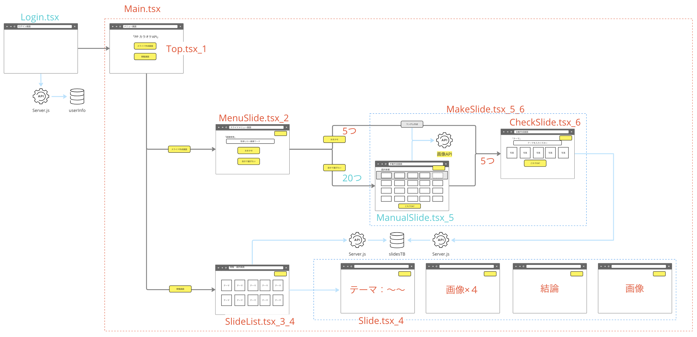
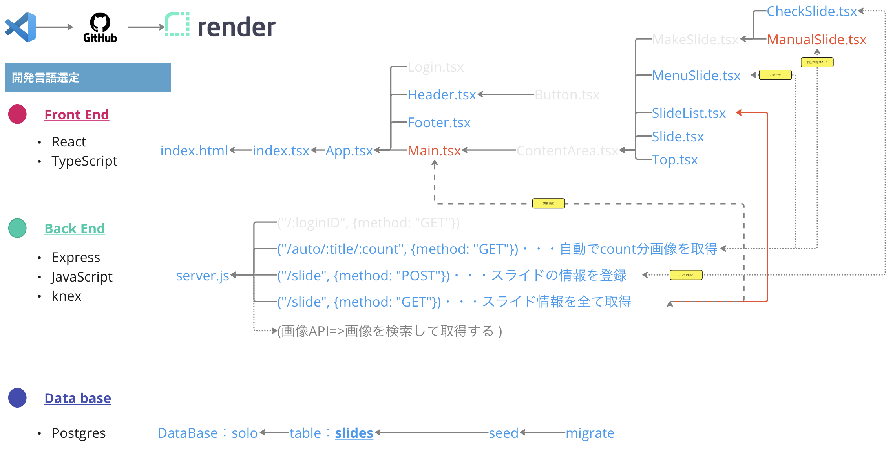
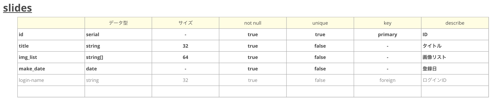

### 【Git 情報】


---

### 【使用システム】

<div>


</div>

<hr>

### 【オススメライブラリ】

<div>


</div>

<hr>

# 目次

<details>

<summary>目次一覧</summary>

<!-- START doctoc generated TOC please keep comment here to allow auto update -->
<!-- DON'T EDIT THIS SECTION, INSTEAD RE-RUN doctoc TO UPDATE -->

- [🎤 システム概要](#-%E3%82%B7%E3%82%B9%E3%83%86%E3%83%A0%E6%A6%82%E8%A6%81)
  - [🎤 背景](#-%E8%83%8C%E6%99%AF)
  - [🎤 使用 URL（デプロイ先）](#-%E4%BD%BF%E7%94%A8-url%E3%83%87%E3%83%97%E3%83%AD%E3%82%A4%E5%85%88)
- [🎤 機能](#-%E6%A9%9F%E8%83%BD)
- [🎤 アーキテクチャー](#-%E3%82%A2%E3%83%BC%E3%82%AD%E3%83%86%E3%82%AF%E3%83%81%E3%83%A3%E3%83%BC)
- [🎤 プログラム構成](#-%E3%83%97%E3%83%AD%E3%82%B0%E3%83%A9%E3%83%A0%E6%A7%8B%E6%88%90)
- [🎤 スキーマ](#-%E3%82%B9%E3%82%AD%E3%83%BC%E3%83%9E)
- [🎤 使用環境](#-%E4%BD%BF%E7%94%A8%E7%92%B0%E5%A2%83)
- [🎤 必要要件](#-%E5%BF%85%E8%A6%81%E8%A6%81%E4%BB%B6)
- [🎤 インストール](#-%E3%82%A4%E3%83%B3%E3%82%B9%E3%83%88%E3%83%BC%E3%83%AB)
- [🎤 使い方](#-%E4%BD%BF%E3%81%84%E6%96%B9)
- [🎤 テスト](#-%E3%83%86%E3%82%B9%E3%83%88)
- [🎤 デプロイ](#-%E3%83%87%E3%83%97%E3%83%AD%E3%82%A4)
- [🎤 その他](#-%E3%81%9D%E3%81%AE%E4%BB%96)
- [🎤 作者](#-%E4%BD%9C%E8%80%85)
- [🎤 今後の計画](#-%E4%BB%8A%E5%BE%8C%E3%81%AE%E8%A8%88%E7%94%BB)
- [🎤 評価基準（8 項目）](#-%E8%A9%95%E4%BE%A1%E5%9F%BA%E6%BA%968-%E9%A0%85%E7%9B%AE)

<!-- END doctoc generated TOC please keep comment here to allow auto update -->

</details>

## 🎤 システム概要

このシステムは「PP カラオケ用のスライドの手助け」を行います。

### 🎤 背景

🚩 下記内容からこのシステムを作成するプロジェクトが開始しました。

- **【困りごと】**
  - 急にカラオケ用の資料を用意しないといけない
  - PM/PD の人が乱入してきた！！（困っていない w）
- **【欲しいシステム】** 被らない画像でスライドを作りたい

### 🎤 使用 URL（デプロイ先）

- 実際のシステム[「🎤〜PP カラオケ API〜🤖 ザマス」](https://hagiiiii.onrender.com)はこちらになります。

## 🎤 機能

- [x] スライドを作成
- [x] スライド管理
- [x] 画像 API から**自動**で 5 つ画像を取得
- [x] 過去のリストを一覧表示
- [ ] 候補を上げてリストから画像を選び、スライドを作成

## 🎤 アーキテクチャー

※<font color="Red">赤文字部</font>：作成済　　<font color="blue">青文字部</font>：未作成


## 🎤 プログラム構成

※<font color="Red">赤文字部</font>：作成済　　<font color="blue">青文字部</font>：未作成


## 🎤 スキーマ



## 🎤 使用環境

- macOS
- node.js
- PostgreSQL

## 🎤 必要要件

- 🔑 [pixabay](https://pixabay.com/ja/) の API キーを取得し、.env に設定

## 🎤 インストール

```
$ git clone https://github.com/〜〜 //クローンする
$ cd 〜〜 //クローンしたディレクトリに移動する
```

## 🎤 使い方

1. ライブラリを `npm i` でインストールしてください。
2. その他起動方法は、[React のドキュメント](/README_Install.ja.md)を参照してください。

## 🎤 テスト

####　フロントエンド

- [ ] 該当要素があるか

####　バックエンド

- [ ] サーバーからステータスコード 200 が返ってくるか

## 🎤 デプロイ

1. DB 作成する
2. WEB SERVICE を作成する
3. Environment Variables で「DATABASE_URL、NODE_ENV」を設定
4. Secret Files で「.env」内に API キーを設定

## 🎤 その他

ユーモアのあるスライドを提案してくれるのでぜひ使ってみてください。

## 🎤 作者

- 萩 巧実

## 🎤 今後の計画

- [ ] 自分で選びたい画面で候補画像をあげる
- [ ] CSS のデザインを記入する
- [ ] テストコードを書く
- [ ] お気に入り登録

## 🎤 評価基準（8 項目）

- [x] データベース、サーバーとフロントが繋がっていて、機能しているか（UI デザインはオプション）
- [x] データベースのスキーマがあるか（Migration file があるか）
- [x] API のエンドポイントがあるか（HTTP メソッド get/post/patch/put/delete の中から最低 1 つは実装している）
- [x] React を使用したフロントサイドが実装できているか（useEffect/useState を必ず使う + 機能している）
- [x] package.json 内にスクリプト（scripts）が書かれているか
- [ ] テストがあるか
- [x] README が書かれているか（明確なセットアップ手順、アプリの詳細、リソース、および将来の計画）
- [x] デプロイされているか
